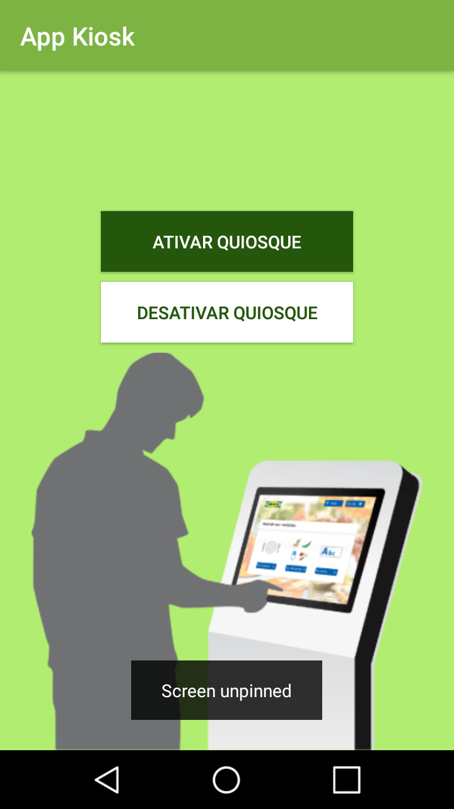
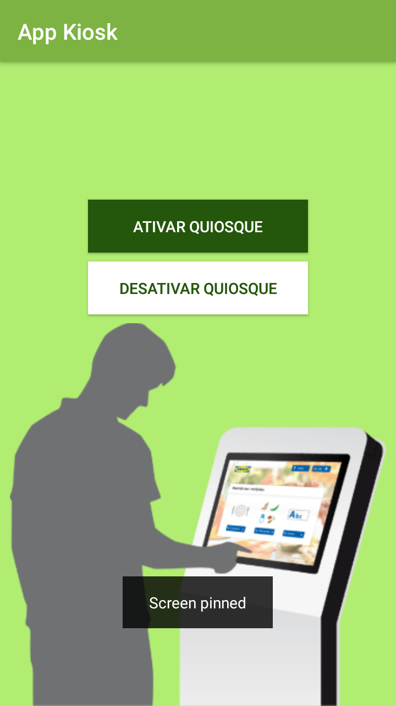
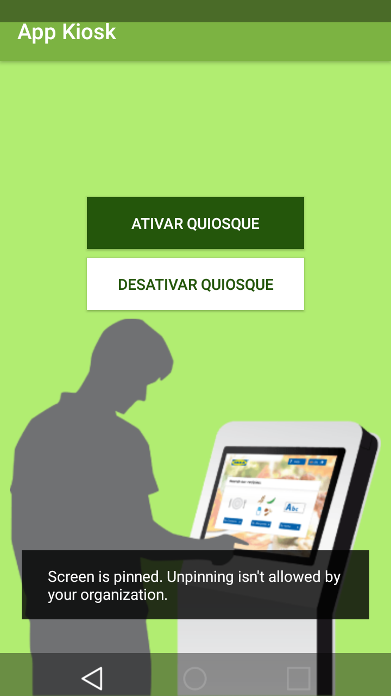

# AppKiosk
App Kiosk, que bloqueia completamente o uso de outros aplicativos e funções do Android. Restringindo o uso apenas à este aplicativo

## Installing</br>
[](https://developer.android.com/about/versions/marshmallow/android-6.0)

  1- Fazer reset de fábrica no celular; </br>
  2- Pular a etapa de adicionar conta Google;</br>
  3- Instalar o app:</br>
  
```
$ adb install path/to/kiosk.apk
```
  4- Setar o app como administrador do dispositivo:</br>
  
```
$ adb shell dpm set-device-owner com.jonasvieira.kioskmode/.MyDeviceAdminReceiver
```

## Screenshots</br>

<p align="center">
  
  
  
</p>

## Author</br>

* Jonas Vieira - jonasvieira.ti@gmail.com </br>
 
[](https://br.linkedin.com/in/jonasvieirati) 
[](https://twitter.com/intent/tweet)
